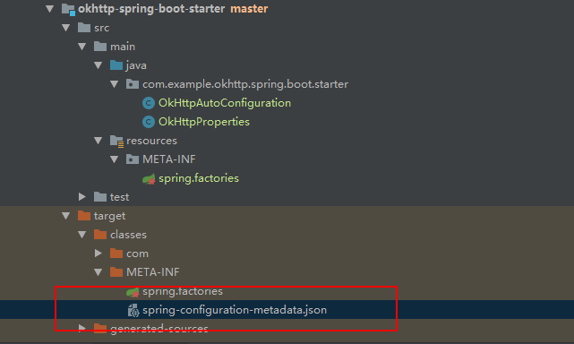
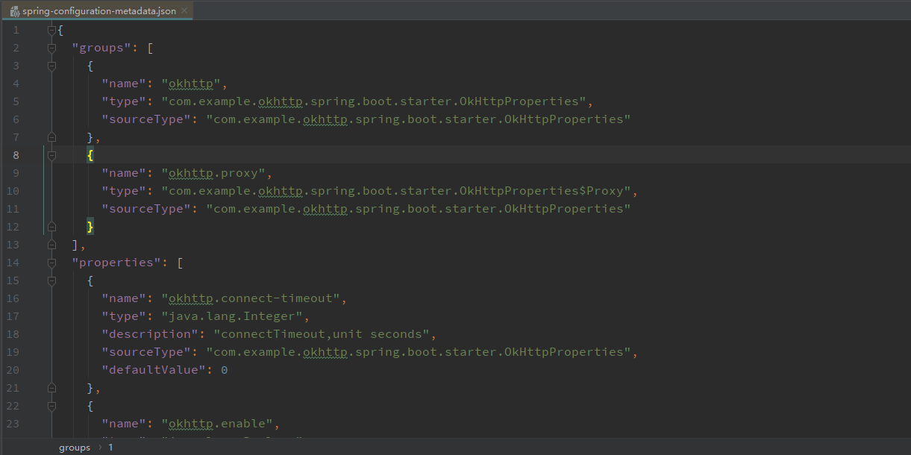
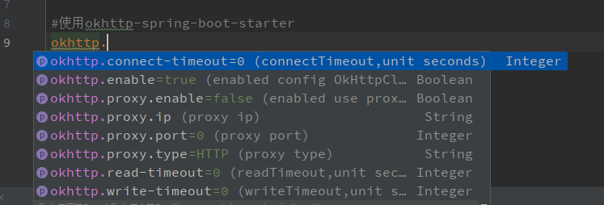
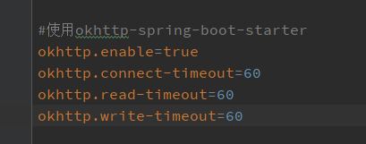
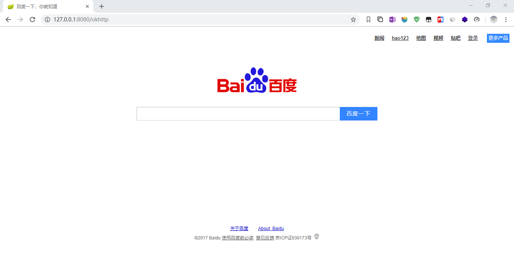

# 创建自己的自动配置

Spring Boot 提供了一种自动化配置 Bean 的机制，可以根据一定的条件自动初始化 Bean。

利用 Spring boot 提供的这种自动配置机制，我们可以创建 spring-boot-starter，一个自动化配置的共享库。

在日常开发中，这种自动化配置的库使用起来十分方便，通常在配置文件中添加对应配置项就可以完成这个starter的配置。

这里去了解下如何创建一个标准的 spring boot starter。

## 了解自动配置bean

Spring Boot使用标准的 `@Configuration` 类实现自动配置，使用 `@Conditional` 注解约束何时应用自动配置。

通常，自动配置类使用 `@ConditionalOnClass` 和`@ConditionalOnMissingBean` 注解，这可确保仅在找到相关类时以及未声明自己的 `@Configuration` 时才应用自动配置。

下面是自动化配置涉及到的注解说明：

- `@Configuration`：说明该类是配置类
- `@EnableConfigurationProperties`：开启属性注入
- `@AutoConfigureAfter`：指定在指定配置类之后进行自动配置
- `@AutoConfigureBefore`：指定在指定配置类之前进行自动配置
- `@AutoConfigureOrder`：该注释具有与常规@Order注释相同的语义，但为自动配置类提供了专用的顺序。
- `@ConditionalOnClass`：当classpath路径下有指定的类的条件下
- `@ConditionalOnMissingClass`：当classpath路径下无指定的类的条件下。
- `@ConditionalOnBean`：当Spring Context中有指定Bean的情况下
- `@ConditionalOnMissingBean`：当Spring Context中没有指定Bean的情况下
- `@ConditionalOnProperty(prefix = "simple.service",value = "enabled",havingValue = "true")`：当配置文件中`simple.service.enabled=true`条件下。
- `@ConditionalOnResource`：当存在特定资源时条件下。
- `@ConditionalOnWebApplication`：当前项目是WEB项目的条件下。
- `@ConditionalOnNotWebApplication`：当前项目不是WEB项目的条件下。
- `@ConditionalOnExpression`：基于SpEL表达式作为判断条件。
- `@ConditionalOnJava`：基于JVM版本作为判断条件。
- `@ConditionalOnJndi`：在JNDI存在的条件下查找指定的位置。
- `@ConditionalOnSingleCandidate`：当指定Bean在容器中只有一个，或者虽然有多个但 是指定首选的Bean。

## 创建一个自己的 spring boot starter

这里先贴一下官方文档对 starter 的说明：

>A full Spring Boot starter for a library may contain the following components:
>
>- The autoconfigure module that contains the auto-configuration code.
>- The starter module that provides a dependency to the autoconfigure module as well as the library and any additional dependencies that are typically useful. In a nutshell, adding the starter should provide everything needed to start using that library.

通过这段话，可以看出一个标准的 starter 需要提供使用这个库的完整功能。

### 了解 spring boot starter 命名规范

同样也是贴下官方文档对命名规范的说明：

>You should make sure to provide a proper namespace for your starter. Do not start your module names with spring-boot, even if you use a different Maven groupId. We may offer official support for the thing you auto-configure in the future.
>
>As a rule of thumb, you should name a combined module after the starter. For example, assume that you are creating a starter for "acme" and that you name the auto-configure module acme-spring-boot-autoconfigure and the starter acme-spring-boot-starter. If you only have one module that combines the two, name it acme-spring-boot-starter.

命名规范如下：

- 自动配置模块的命名规范为：`xxx-spring-boot-autoconfigure`
- 如果只有一个模块，这个模块包含自动配置模块，则它的命名规范为：`xxx-spring-boot-starter`

### 创建一个 okhttp 库的 starter

这里选择一个常用的http库 `okhttp` 来创建 `okhttp-spring-boot-starter`。

创建一个标准的starter需要有`spring-boot-starter`、`spring-boot-autoconfigure`和`spring-boot-configuration-processor`依赖，用于提供自动化配置支持。

pom文件如下：

```xml
    <dependencies>
        <dependency>
            <groupId>org.springframework.boot</groupId>
            <artifactId>spring-boot-starter</artifactId>
        </dependency>
        <dependency>
            <groupId>org.springframework.boot</groupId>
            <artifactId>spring-boot-autoconfigure</artifactId>
        </dependency>
        <dependency>
            <groupId>org.springframework.boot</groupId>
            <artifactId>spring-boot-configuration-processor</artifactId>
            <optional>true</optional>
        </dependency>

        <dependency>
            <groupId>com.squareup.okhttp3</groupId>
            <artifactId>okhttp</artifactId>
            <version>4.1.0</version>
        </dependency>
    </dependencies>
```

### 创建自动化配置类

1.创建配置类

```java
import lombok.Data;
import org.springframework.boot.context.properties.ConfigurationProperties;

/**
 * okhttp配置类
 */
@Data
@ConfigurationProperties(prefix = OkHttpProperties.OKHTTP_PREFIX)
public class OkHttpProperties {

    public static final String OKHTTP_PREFIX = "okhttp";
    public static final String ENABLE_KEY = "enable";

    /**
     * enabled config OkHttpClient
     */
    private boolean enable = true;
    /**
     * connectTimeout,unit seconds
     */
    private int connectTimeout;
    /**
     * writeTimeout,unit seconds
     */
    private int writeTimeout;
    /**
     * readTimeout,unit seconds
     */
    private int readTimeout;
    /**
     * proxy config
     */
    private Proxy proxy;

    @Data
    class Proxy {
        /**
         * enabled use proxy
         */
        private boolean enable = false;
        /**
         * proxy type
         */
        private String type = "HTTP";
        /**
         * proxy ip
         */
        private String ip;
        /**
         * proxy port
         */
        private int port;
    }

}
```

2.创建配置类

```java
import okhttp3.OkHttpClient;
import org.springframework.beans.factory.annotation.Autowired;
import org.springframework.boot.autoconfigure.condition.ConditionalOnClass;
import org.springframework.boot.autoconfigure.condition.ConditionalOnMissingBean;
import org.springframework.boot.autoconfigure.condition.ConditionalOnProperty;
import org.springframework.boot.context.properties.EnableConfigurationProperties;
import org.springframework.context.annotation.Bean;
import org.springframework.context.annotation.Configuration;

import java.net.InetSocketAddress;
import java.net.Proxy;
import java.util.concurrent.TimeUnit;

/**
 * OkHttp自动配置类
 */
@Configuration
@ConditionalOnClass(OkHttpClient.class)
@EnableConfigurationProperties(OkHttpProperties.class)
public class OkHttpAutoConfiguration {

    @Autowired
    private OkHttpProperties properties;

    @Bean
    @ConditionalOnMissingBean
    @ConditionalOnProperty(prefix = OkHttpProperties.OKHTTP_PREFIX, value = OkHttpProperties.ENABLE_KEY, havingValue = "true")
    OkHttpClient okHttpClient() {
        OkHttpClient.Builder builder = new OkHttpClient.Builder();

        //设置代理
        if (properties.getProxy() != null && properties.getProxy().isEnable()) {
            builder.proxy(
                    new Proxy(Proxy.Type.valueOf(properties.getProxy().getType()),
                            new InetSocketAddress(properties.getProxy().getIp(), properties.getProxy().getPort()))
            );
        }

        builder.retryOnConnectionFailure(true)
                .connectTimeout(properties.getConnectTimeout(), TimeUnit.SECONDS)
                .writeTimeout(properties.getWriteTimeout(), TimeUnit.SECONDS)
                .readTimeout(properties.getReadTimeout(), TimeUnit.SECONDS)
        ;

        return builder.build();
    }

}
```

### 让 Spring Boot 找到自动化配置类

**starter 原理**：

>Spring Boot 会在启动时扫描项目所依赖的jar包，寻找包含 `spring.factories` 文件的jar包，根据 `spring.factories` 配置加载自动化配置类。
>
>再根据`@Conditional`注解的条件，进行自动配置并将 Bean 注入 Spring Context 中。

**创建 spring.factories 文件**：

根据starter的创建规范，我们需要创建`spring.factories` 文件，并且放置在`src/main/resources/META-INF` 目录下，用于标识需要自动化配置的类。

`spring.factories`文件内容如下：

```properties
org.springframework.boot.autoconfigure.EnableAutoConfiguration=\
com.example.okhttp.spring.boot.starter.OkHttpAutoConfiguration
```

starter 编译后，会根据配置类自动生成对应的 `spring-configuration-metadata.json` 属性元文件：





该属性元文件会为配置属性提供对应的注释说明：



### 使用starter

在项目 pom 文件中添加自己创建的 starter 依赖：

```xml
<dependency>
    <groupId>com.example</groupId>
    <artifactId>okhttp-spring-boot-starter</artifactId>
    <version>0.0.1-SNAPSHOT</version>
</dependency>
```

在配置文件中添加属性：



使用该 okhttp 实例

```java
    @Autowired
    private OkHttpClient okHttpClient;

    @GetMapping("/okhttp")
    public String useOkHttp() throws IOException {
        Request request = new Request.Builder()
                .url("https://www.baidu.com/")
                .get()
                .build();
        Response response = okHttpClient.newCall(request).execute();
        return Objects.requireNonNull(response.body()).string();
    }
```

运行，查看结果



通过运行结果可以看到自动配置的 okHttpClient 生效了。

可以看到 `spring-boot-starter` 它帮助我们简化库的配置，利用 starter 的机制可以编写出一些简化配置的整合库，提高开发效率。
