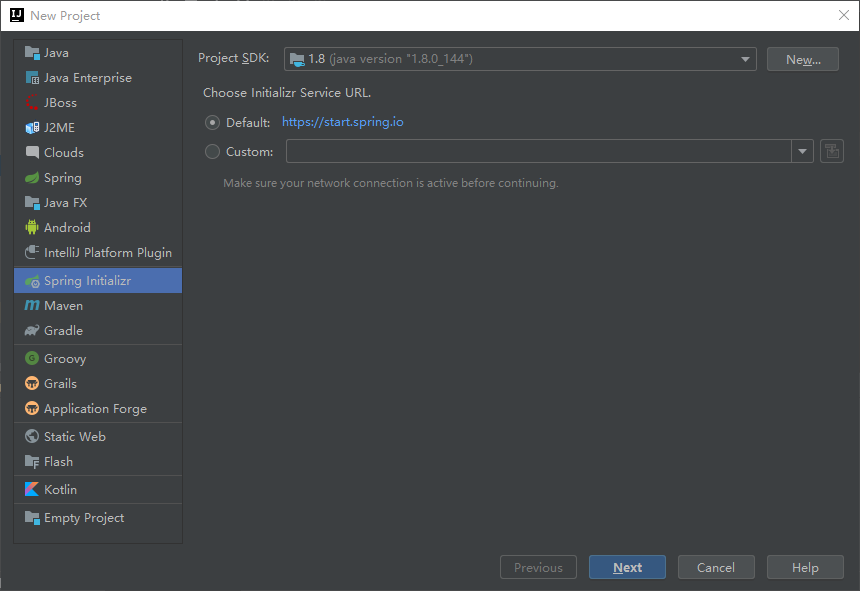
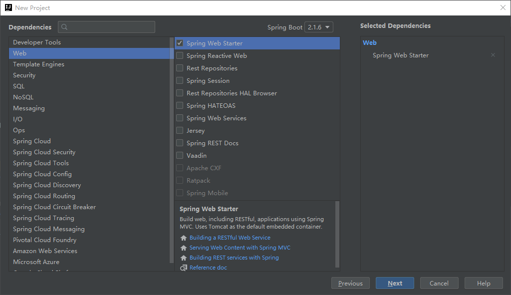
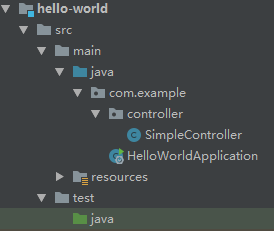
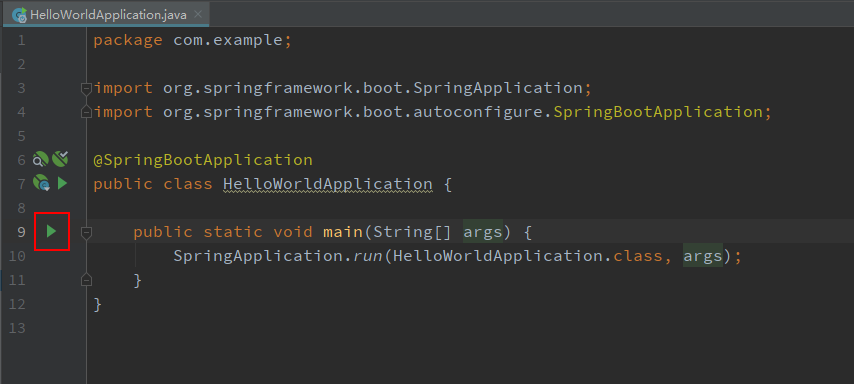
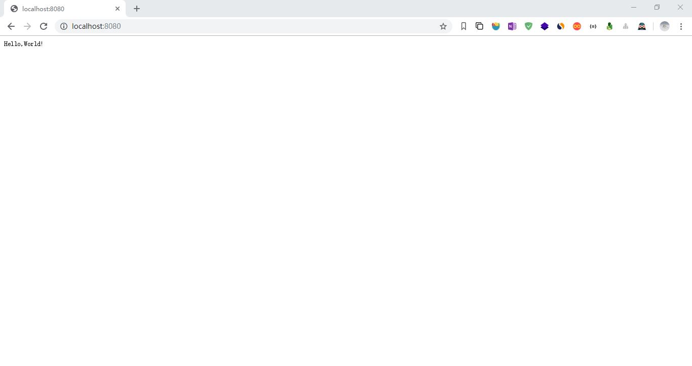
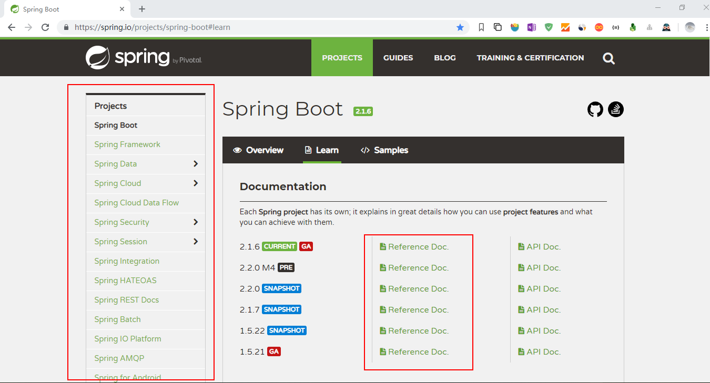
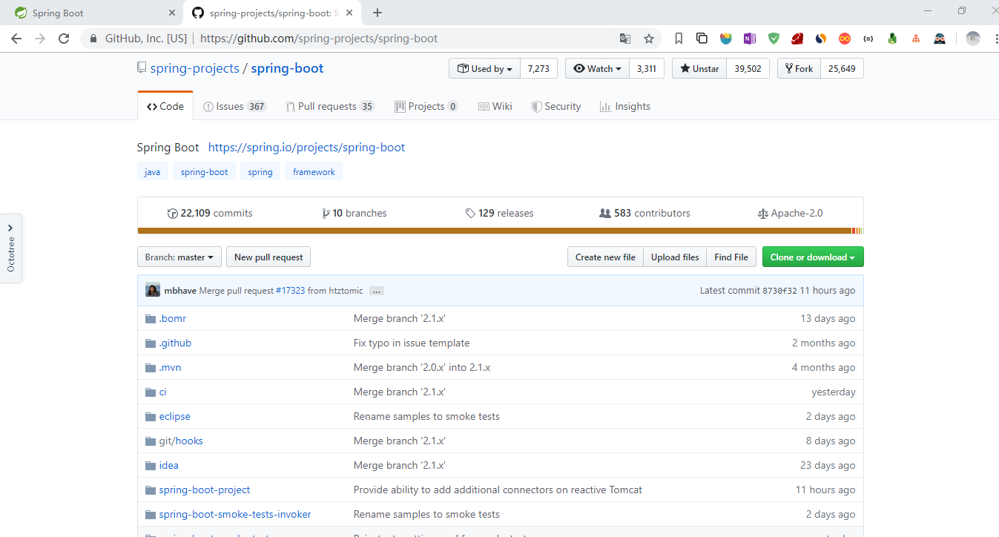

# 给世界的第一声问候

建立一个Spring Boot的Hello World项目非常简单。

1.使用Spring官方提供的初始化工具创建项目：<https://start.spring.io>

IntelliJ IDEA:



2.勾选web依赖，web依赖中包含Spring MVC和嵌入式的tomcat



3.创建后，Maven项目的pom.xml如下

```xml
<?xml version="1.0" encoding="UTF-8"?>
<project xmlns="http://maven.apache.org/POM/4.0.0" xmlns:xsi="http://www.w3.org/2001/XMLSchema-instance"
         xsi:schemaLocation="http://maven.apache.org/POM/4.0.0 http://maven.apache.org/xsd/maven-4.0.0.xsd">
    <modelVersion>4.0.0</modelVersion>
    <groupId>com.example</groupId>
    <artifactId>hello</artifactId>
    <version>0.0.1-SNAPSHOT</version>
    <packaging>jar</packaging>
    <name>hello</name>
    <description>Demo project for Spring Boot</description>

    <parent>
        <groupId>org.springframework.boot</groupId>
        <artifactId>spring-boot-starter-parent</artifactId>
        <version>2.0.0.RELEASE</version>
        <relativePath/> <!-- lookup parent from repository -->
    </parent>

    <properties>
        <project.build.sourceEncoding>UTF-8</project.build.sourceEncoding>
        <project.reporting.outputEncoding>UTF-8</project.reporting.outputEncoding>
        <java.version>1.8</java.version>
    </properties>

    <dependencies>
        <dependency>
            <groupId>org.springframework.boot</groupId>
            <artifactId>spring-boot-starter-web</artifactId>
        </dependency>
    </dependencies>

    <build>
        <plugins>
            <plugin>
                <groupId>org.springframework.boot</groupId>
                <artifactId>spring-boot-maven-plugin</artifactId>
            </plugin>
        </plugins>
    </build>

</project>
```

4.在Application类同级目录下创建Controller类



```java
import org.springframework.web.bind.annotation.GetMapping;
import org.springframework.web.bind.annotation.RestController;

@RestController
public class SimpleController {

    @GetMapping("/")
    public String sayHello() {
        return "Hello,World!";
    }
}
```

5.启动项目，运行Application类的main方法



6.查看运行结果




运行成功，通过浏览器访问 **<http://localhost:8080/>** ，可以看到成功返回了Hello World。

---

使用Spring Boot创建一个Hello World项目可以看到非常简单，但是需要一些前置条件,在IDE中配置好以下环境：

- java环境
- maven环境

---

对于Spring Boot入门来说，一个Hello World只能看到它简化开发的一面，更详细准确的资料就要查询官网了。
Spring官方提供的文档非常详细，每个版本和每个整合的模块都有对应的文档，可以直接通过官网进行学习。

**[Spring Boot开发文档地址](https://spring.io/projects/spring-boot#learn)**：



**[Spring Boot项目Github地址](https://github.com/spring-projects/spring-boot)**：


